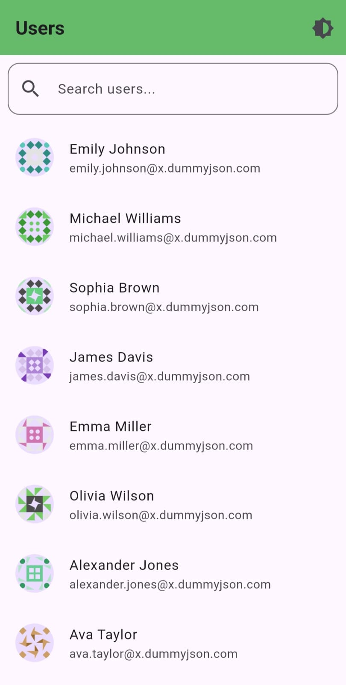
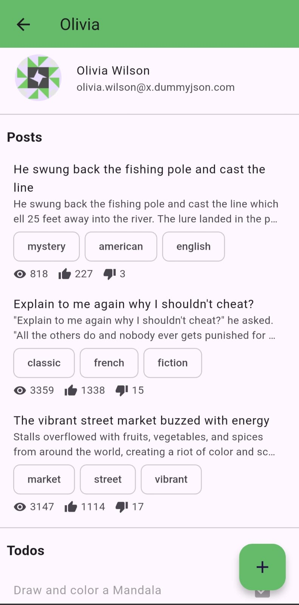
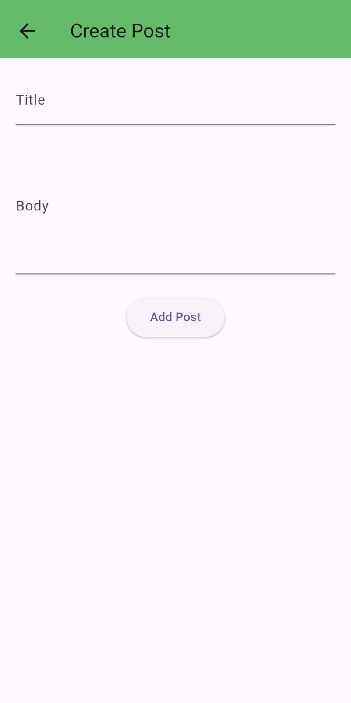
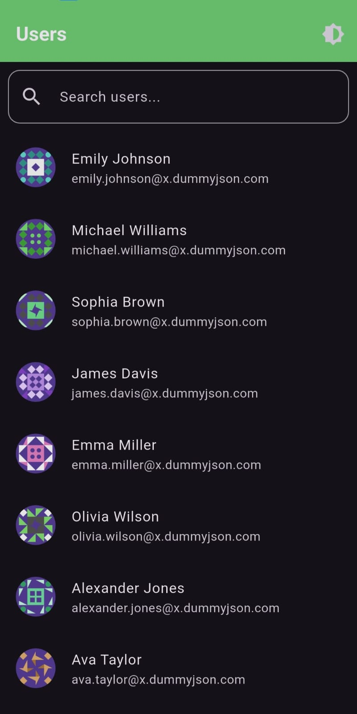
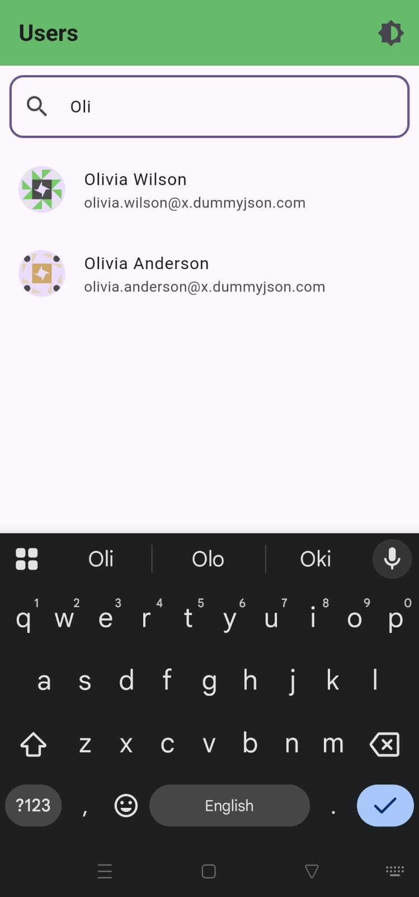

# Flutter User Management App

A user management system built with Flutter using **BLoC pattern**, **clean architecture**, **API integration** (DummyJSON), and advanced UI features like **theme toggling**, **pagination**, **pull-to-refresh**, and **search**.

---

## 🚀 Setup Instructions

1. **Clone the repository:**
   ```bash
   git clone https://github.com/shivamtechstack/user-managment-assignment.git
   cd user-managment-assignment
   
### Installation

```bash

flutter pub get

```

### Running the App

```bash

flutter run

```

### Run on Specific Device

```bash

flutter devices

flutter run -d <device_id>

```

## 🌟 Features

- View user details with nested posts and todos

- Pull-to-refresh functionality

- Pagination with lazy loading

- Dark/light theme toggle

- Clean architecture using BLoC pattern

- Responsive design

## 🧠 Architecture

The app follows Clean Architecture principles with layered structure:

### 🧱 Layers

1. **Presentation Layer** (UI + BLoC):

- Screens and widgets

- BLoC for state management

2. **Domain Layer** (Repositories):

- Interfaces for data sources

3. **Data Layer** (Providers):

- API implementation using HTTP

### 🧩 Design Patterns

- **BLoC** for state management

- **Repository pattern** to abstract data sources

- **Dependency Injection** using `MultiRepositoryProvider`

## 📁 Folder Structure

```

lib/

│

├── blocs/

│   ├── user_bloc.dart

│   ├── user_event.dart

│   └── user_state.dart

│

├── models/

│   ├── user.dart

│   ├── post.dart

│   └── todo.dart

│

├── providers/

│   └── user_api_provider.dart

│

├── repositories/

│   ├── user_repository.dart

│   ├── post_repository.dart

│   └── todo_repository.dart

│

├── screens/

│   └── user_list_screen.dart

│

└── main.dart

```

## 🌗 Theme Management

Switch between light/dark modes via AppBar. Theme state is maintained using `ValueNotifier`.

## 📸 Screenshots

<p align="center">







<br>





</p>

## 🎥 Video Preview

[App Demo Video](preview/previewvideo.mp4)

## 👤 Author

**Shivam Yadav**

📧 [shivam16yadav16@gmail.com](mailto:shivam16yadav16@gmail.com)

